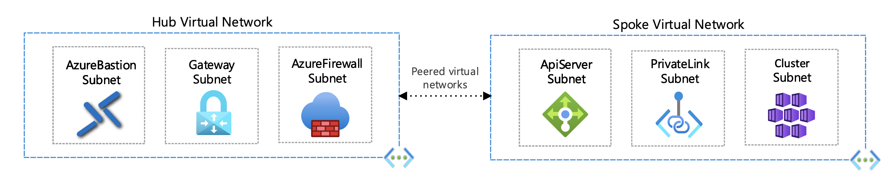
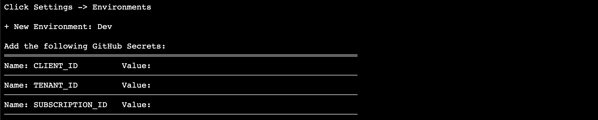
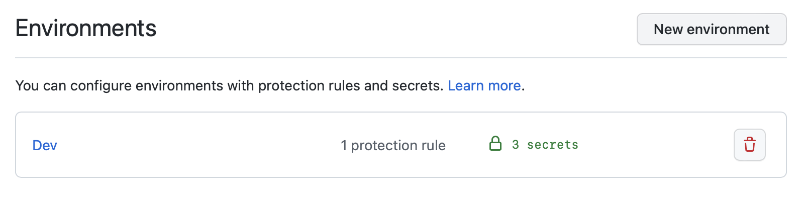
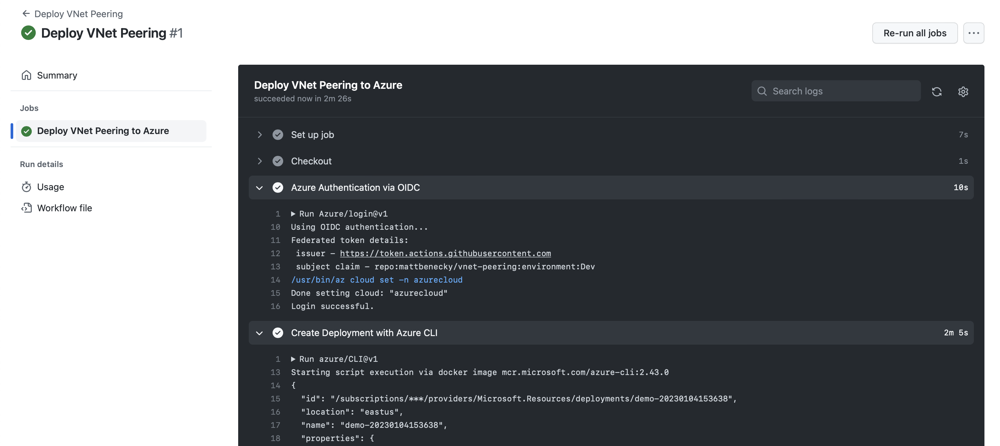
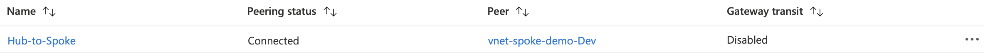
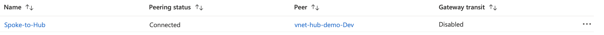

# Virtual Network Peering

This provides a sample virtual network peering to connect two or more virtual networks in Azure. The traffic that passes between peered virtual networks is routed directly through the Microsoft backbone infrastructure, not through a gateway or over the public internet.

- A low-latency, high-bandwidth connection between resources in different virtual networks
- The ability for resources in one virtual network to communicate with resources in a different virtual network
- The ability to transfer data between virtual networks across Azure subscriptions, Azure AD tenants, deployment models, and Azure regions



## Getting Started

1. Fork this repository into your account.

2. Launch [Cloud Shell](https://shell.azure.com/bash). (Open Link in New Tab)

```COPY``` the following line 👇
```
curl -LJO https://raw.githubusercontent.com/mattbenecky/vnet-peering/main/src/infra/setup.sh && chmod +x setup.sh && ./setup.sh
```
```PASTE``` in [Cloud Shell](https://shell.azure.com/bash) & press ```ENTER```



3. Get your GitHub secrets ready:

```CLIENT_ID```
```TENANT_ID```
```SUBSCRIPTION_ID```



## Deploy Virtual Network Peering

1. Run GitHub Actions workflow ```Deploy VNet Peering```







## Cleaning Up

1. Launch [Cloud Shell](https://shell.azure.com/bash). (Open Link in New Tab)

```COPY``` the following line 👇
```
curl -LJO https://raw.githubusercontent.com/mattbenecky/vnet-peering/main/src/infra/cleanup.sh && chmod +x cleanup.sh && ./cleanup.sh
```
```PASTE``` in [Cloud Shell](https://shell.azure.com/bash) & press ```ENTER```
